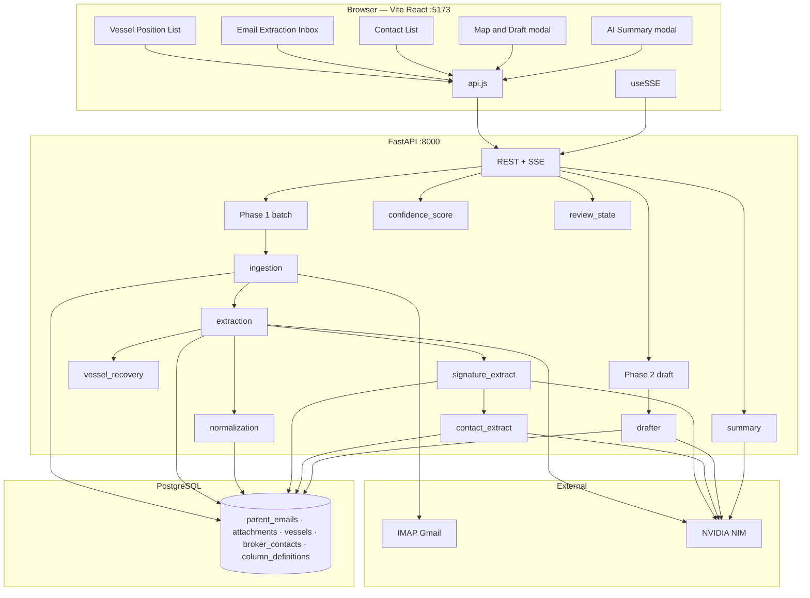

# AI-Powered Shipbroking Email Parser

Agentic pipeline that fetches `.eml` attachments from Gmail (IMAP), extracts vessel position rows with **NVIDIA NIM**, recovers missed rows with **rule-based parsers**, extracts **structured broker contacts**, and stores everything in **PostgreSQL**. A **three-tab React UI** covers **Vessel Position List** → **Email Extraction Inbox** → **Contact List**. Draft output opens in a **map + grid modal** with copy, PDF export, and **AI Summary** briefings. Real-time progress uses **Server-Sent Events (SSE)**.

Repository: [github.com/DeoUtkarsh/Asset_Mail_Parsing](https://github.com/DeoUtkarsh/Asset_Mail_Parsing)

---

## Features at a glance

| Area | What you get |
|------|----------------|
| **Email Extraction Inbox** | Fetch inbox, live SSE status, attachment preview (HTML/plain/screenshots), **confidence scoring**, per-attachment verify, retry failed extractions |
| **Vessel extraction** | NVIDIA LLM → JSON vessels; automatic **fallback** via vertical tonnage + broker-specific rule parsers when LLM returns zero rows |
| **Confidence triage** | Rule-based 0–100 score per attachment (High / Medium / Low); **· Reviewed** label after preview edits; clears when data matches extraction baseline |
| **Signatures** | Per-attachment broker emails/phones (LLM + regex fallback) on `attachments` |
| **Contacts** | Per-attachment structured rows in `broker_contacts` (15 fields, LLM + signature fallback, vessel name enrichment); **Export CSV** |
| **Vessel Position List** | Verified vessels only, 26-column grid, column picker for draft, select-all vessels, **All columns** toggle (summary vs full) |
| **Draft** | Zone-grouped HTML email, Leaflet map, copy to clipboard (selected columns only), landscape **PDF** when 10+ columns |
| **AI Summary** | Fresh broker-style briefing + bar charts on every tab (stats computed in code, LLM writes the narrative) |

---

## Architecture



---

## End-to-end pipeline

### Phase 1 — Fetch and extract (automatic)

Triggered by **Fetch Emails** (`POST /api/fetch-emails`). Runs in the background; UI listens on `GET /api/events/{job_id}`.

```
Ingestion (IMAP)
  → Extraction (NVIDIA LLM per attachment)
  → Vessel recovery fallback (if LLM returned 0 rows)
  → Signature extraction (LLM + regex → attachments.signature_*)
  → Contact extraction (LLM + signature fallback → broker_contacts)
  → Normalization (standard column keys in vessels.dynamic_data)
  → Review baseline saved per attachment (for confidence + Reviewed tracking)
```

| Step | Module | Details |
|------|--------|---------|
| **Ingestion** | `agents/ingestion.py` | Finds matching parent emails not yet in DB; saves `.eml` parts. `MAX_ATTACHMENTS=0` processes **all** parts; `N>0` caps at first N. |
| **Extraction** | `agents/extraction.py` | NVIDIA chat → JSON vessel array → insert into `vessels`. Throttled concurrency + retries on rate limits. Saves `review_baseline` on completion. |
| **Vessel recovery** | `agents/vessel_recovery.py` | If LLM returns empty: **vertical tonnage** parser, then **structured rule parsers** (`structured_parsers.py`). Same logic on every fetch and retry. |
| **Signatures** | `agents/signature_extract.py` | Broker emails/phones from attachment body tail; regex fills gaps. |
| **Contacts** | `agents/contact_extract.py` | Up to 15 structured fields per contact row; signature fallback; vessel name enrichment. Runs after signatures on fetch, email retry, and single-attachment retry. |
| **Normalization** | `agents/normalization.py` | Maps raw keys to standard schema; sets parent email `ready_for_validation`. |
| **Confidence** | `agents/confidence_score.py` | Rule-based 0–100 score per attachment for inbox triage (computed on `GET /api/emails`). |
| **Review state** | `agents/review_state.py` | Tracks `manually_reviewed` vs extraction `review_baseline` when users edit cells in Preview. |

**Retry paths** (same contact + recovery logic):

- `POST /api/emails/{id}/retry-extraction` — all failed/pending attachments on one email  
- `POST /api/attachments/{id}/retry-extraction` — one attachment only  

### Verification gate

Attachments must be **verified** before their vessels appear on the **Vessel Position List**:

- **Per-attachment Verify** on Email Extraction Inbox (and in Preview modal)  
- Un-verify to edit vessel rows again  

Only rows from verified attachments are returned by `GET /api/vessels` (via `vessels_full` view).

### Phase 2 — Draft email

Triggered by **Generate Draft** on the Vessel Position List (`POST /api/generate-draft`).

- Input: selected vessel rows (or all if none checked) + **selected column ids** for the email table  
- **Drafter** (`agents/drafter.py`): groups by trade zone, builds HTML tables aligned with grid columns, short intro via LLM  
- SSE `drafting_done` delivers `draft_html` + `zones` for the Leaflet map  
- **Map & Draft modal**: map + legend + read-only grid, **Copy to Clipboard**, **Download PDF** (landscape, 10+ columns), **AI Summary** for draft vessels  

---

## UI tabs

Default landing tab: **Vessel Position List**.

### 1. Vessel Position List (`ValidationView`)

- `GET /api/vessels` — all verified vessels across validation-ready emails  
- **26 columns** from `GET /api/columns` (PostgreSQL `column_definitions`)  
- **All columns** toggle — summary columns (10) vs full grid (26)  
- **Column checkboxes** in headers — pick which columns go into the draft email; stat shows **Columns selected** count  
- **Vessel checkboxes** — draft uses selection only; if none checked, all rows are sent  
- Inline cell edit → `PUT /api/vessels/{id}`  
- **Generate Draft** → Phase 2 → opens Map & Draft modal  
- **AI Summary** — all vessels or **selected vessels only** when checkboxes are ticked  

### 2. Email Extraction Inbox (`InboxView`)

- Lists parent emails and attachments with extraction status  
- **Confidence** column — rule-based score with High (green) / Medium (orange) / Low (red) badges  
- **Preview** — sanitized HTML/plain/inline images + editable extracted vessels  
- **Verify** — per attachment only (moves vessels into the position list)  
- **Reviewed** — appears on confidence badge after preview edits; clears when saved data matches extraction baseline  
- **Retry** failed or zero-vessel attachments  
- **AI Summary** — emails in view: counts, verification backlog, zone/type charts, narrative  

#### Confidence scoring (summary)

| Tier | Score | Meaning |
|------|--------|---------|
| **High** | ≥ 75 | Usually safe to verify quickly |
| **Medium** | 55–74 | Quick preview recommended |
| **Low** | &lt; 55 | Inspect before verifying |

Score = field completeness (5 key columns) + critical presence + extraction consistency − anomaly penalties + text quality. See `agents/confidence_score.py` for full rules.

### 3. Contact List (`ContactListView`)

- `GET /api/contacts` — flat list: 4 context columns (date, subject, sender, attachment) + **15 contact fields**  
- Populated automatically on fetch  
- Yellow rows = `used_fallback` (signature fallback filled gaps LLM missed)  
- Double-click to edit → `PUT /api/contacts/{contact_id}`  
- **Export CSV** — download all visible contacts  
- **AI Summary** — contact counts, email/phone coverage, top companies  

---

## AI Summary

Available on **every tab** (+ draft modal). Each click **fetches fresh data** (no client cache).

1. Backend aggregates facts in SQL/Python (counts, zones, vessel types, opening buckets, etc.)  
2. Small JSON brief is sent to NVIDIA LLM to write a 3–5 sentence broker briefing  
3. Modal shows stat pills, **horizontal bar charts**, narrative, and **Copy summary**  

| Endpoint | Scope |
|----------|--------|
| `POST /api/summary/inbox` | `{ email_ids: [...] }` — Email Extraction Inbox rows |
| `POST /api/summary/vessels` | `{ vessel_ids: [...] }` — selected or all position-list vessels |
| `POST /api/summary/contacts` | `{ contact_ids: [...] }` — current contact rows |

Numbers always come from code; the LLM only narrates provided facts.

---

## Tech stack

| Layer | Technology |
|--------|------------|
| Backend | Python 3.11+, FastAPI, uvicorn |
| Orchestration | LangGraph (Phase 1 graph + Phase 2 drafter) |
| LLM | NVIDIA NIM (`NVIDIA_LLM_MODEL`, e.g. Nemotron) |
| Database | PostgreSQL (`pg_db.py` Supabase-style client) |
| Real-time | SSE (`sse-starlette`), `useSSE.js` |
| Frontend | React 18, Vite, TailwindCSS |
| Grid | TanStack Table v8 |
| Map | Leaflet / react-leaflet |
| PDF | jsPDF + html2canvas (Leaflet capture) + OpenStreetMap tiles |

---

## Repository layout

```
├── schema.sql                    # DDL — parent_emails, attachments, vessels, broker_contacts, views
├── README.md
├── docs/aws-deployment/          # ECS / RDS / S3 / CloudFront runbook
├── backend/
│   ├── .env.example
│   ├── Dockerfile
│   ├── main.py                   # FastAPI routes, SSE, Phase 1/2 runners
│   ├── config.py
│   ├── database.py
│   ├── pg_db.py                  # PostgreSQL client + startup migrations
│   ├── column_defs.py            # Standard keys + column_definitions seed/migration
│   ├── email_preview.py          # Sanitized HTML/plain preview
│   ├── imap_client.py
│   ├── mail_targets.py           # IMAP fetch rules (sender/subject targets)
│   ├── models.py
│   ├── sse_manager.py
│   ├── verification.py           # Attachment verify / un-verify
│   ├── workflow.py               # LangGraph Phase 1 + Phase 2
│   └── agents/
│       ├── ingestion.py
│       ├── extraction.py         # LLM extraction + calls vessel_recovery
│       ├── vessel_recovery.py    # Vertical + rule parsers (live fallback)
│       ├── structured_parsers.py
│       ├── vertical_tonnage.py
│       ├── eta_foc.py
│       ├── normalization.py
│       ├── signature_extract.py
│       ├── contact_extract.py
│       ├── confidence_score.py   # Attachment confidence triage
│       ├── review_state.py       # Reviewed flag vs extraction baseline
│       ├── drafter.py
│       └── summary.py            # AI Summary aggregation + narrative
└── frontend/
    ├── vite.config.js            # Proxy /api → :8000
    ├── package.json
    └── src/
        ├── App.jsx
        ├── services/api.js
        ├── hooks/useSSE.js
        ├── components/
        │   ├── InboxView/        # Email Extraction Inbox
        │   ├── ValidationView/   # Position list + DraftModal + AllColumnsToggle
        │   ├── ContactListView/
        │   ├── DraftView/        # Map, grid, PDF, copy, AI Summary
        │   └── AiSummary/        # Shared summary modal + button
        └── utils/
            ├── standardColumns.js
            ├── copyEmailHtml.js
            ├── downloadDraftPdf.js
            ├── exportContactsCsv.js
            ├── mapBounds.js
            ├── zoneMapping.js
            └── emailPreview.js
```

There are **no standalone dev scripts** in this repo — extraction, recovery, and contacts all run inside the main pipeline (`workflow.py` / `main.py`).

---

## AWS deployment

Full runbook: **[docs/aws-deployment/README.md](docs/aws-deployment/README.md)** (Phases 0–7, troubleshooting, prod cutover).

**Dev environment:** https://d2bt5vx8sl8jq9.cloudfront.net — ECS + RDS + S3 + CloudFront in `ap-southeast-1` (`emailparsing-dev`).

---

## Prerequisites

- **Python 3.11+**
- **Node.js 18+**
- **PostgreSQL** — database created; `schema.sql` applied (backend also migrates on startup)
- **Gmail** with **App Password** for IMAP
- **NVIDIA NIM** API key — [integrate.api.nvidia.com](https://integrate.api.nvidia.com)

---

## One-time setup

### 1. Database

Create a database (e.g. `email_parser`), then run **`schema.sql`** in pgAdmin or `psql`.  
On backend startup, `pg_db.py` applies column migrations and `column_defs.py` seeds `column_definitions`.

### 2. Backend

```powershell
cd backend
copy .env.example .env
# Edit .env: EMAIL_*, FILTER_SENDER, TARGET_SUBJECT, NVIDIA_*, PG_*
```

```powershell
# From repo root
python -m venv venv
.\venv\Scripts\Activate.ps1
cd backend
pip install -r requirements.txt
```

### 3. Frontend

```powershell
cd frontend
npm install
```

---

## Run locally

**Terminal 1 — API**

```powershell
cd backend
..\venv\Scripts\Activate.ps1
uvicorn main:app --reload --port 8000
```

- API: http://localhost:8000  
- OpenAPI: http://localhost:8000/docs  

**Terminal 2 — UI**

```powershell
cd frontend
npm run dev
```

- App: http://localhost:5173  

### Typical workflow

1. Open **Vessel Position List** (default tab) — empty until you verify attachments  
2. Go to **Email Extraction Inbox** → **Fetch Emails** — wait for SSE to finish  
3. Check **Confidence** badges; **Preview** attachments; edit cells if needed  
4. **Verify** attachments with good extractions (per attachment)  
5. Return to **Vessel Position List** — edit cells, select vessels/columns  
6. **Generate Draft** → review map + grid → **Copy** or **Download PDF**  
7. **Contact List** fills automatically; edit contacts or **Export CSV** as needed  
8. Use **AI Summary** on any tab for a quick briefing  

---

## Optional: share via ngrok

Tunnel the **Vite** port so `/api` stays proxied locally:

```text
ngrok http 5173
```

Add your ngrok host to `frontend/vite.config.js` (`allowedHosts`). Keep backend, frontend, and ngrok running.

---

## Environment variables

| Variable | Purpose |
|----------|---------|
| `EMAIL_USER` | Gmail address |
| `EMAIL_PASSWORD` | Gmail **App Password** |
| `IMAP_SERVER` / `IMAP_PORT` | Default `imap.gmail.com` / `993` |
| `FILTER_SENDER` | Legacy optional filter (fetch rules also in `mail_targets.py`) |
| `TARGET_SUBJECT` | Legacy optional subject filter |
| `NVIDIA_API_KEY` | NVIDIA NIM key |
| `NVIDIA_LLM_MODEL` | Chat model — extraction, signatures, contacts, draft intro, AI summary |
| `NVIDIA_API_BASE_URL` | Default NVIDIA integrate endpoint |
| `PG_HOST` / `PG_PORT` / `PG_DATABASE` / `PG_USER` / `PG_PASSWORD` | PostgreSQL |
| `MAX_ATTACHMENTS` | `0` = all `.eml` parts; `N>0` = first N only |
| `EXTRACTION_CONCURRENCY` | Parallel LLM attachment jobs (default `2`) |
| `EXTRACTION_REQUEST_DELAY_SEC` | Pause between attachment LLM calls |

---

## API reference (prefix `/api`)

| Method | Path | Role |
|--------|------|------|
| GET | `/health` | Health + DB check |
| POST | `/fetch-emails` | Start Phase 1 batch → `job_id` |
| POST | `/emails/{id}/retry-extraction` | Retry failed attachments on one email |
| POST | `/attachments/{id}/retry-extraction` | Retry one attachment |
| GET | `/events/{job_id}` | SSE stream |
| GET | `/emails` | Parent emails + attachments (includes confidence + reviewed) |
| GET | `/emails/{id}/attachments` | Attachments for one email |
| GET | `/attachments/{id}/raw` | Preview payload + signature fields + `manually_reviewed` |
| GET | `/attachments/{id}/vessels` | Vessels for preview modal |
| PUT | `/attachments/{id}/verified` | Verify / un-verify attachment |
| GET | `/vessels` | Verified vessels (position list) |
| GET | `/emails/{id}/vessels` | Verified vessels for one email |
| GET | `/columns` | Column definitions |
| PUT | `/vessels/{id}` | Update vessel row (sets reviewed state) |
| DELETE | `/vessels/{id}` | Delete vessel row |
| POST | `/emails/{id}/vessels` | Add blank vessel row |
| GET | `/contacts` | Broker contact rows with email context |
| PUT | `/contacts/{contact_id}` | Update one contact row |
| PUT | `/attachments/{id}/contacts` | Update attachment signature emails/phones |
| POST | `/summary/inbox` | AI summary — Email Extraction Inbox |
| POST | `/summary/vessels` | AI summary — position list / selection |
| POST | `/summary/contacts` | AI summary — contact list |
| POST | `/generate-draft` | Phase 2 → `job_id`, then SSE `drafting_done` |

---

## Database tables (summary)

| Table / column | Purpose |
|----------------|---------|
| `parent_emails` | One row per fetched Gmail message |
| `attachments` | `.eml` files, raw text, preview fields, signatures, `is_verified`, `manually_reviewed`, `review_baseline` |
| `vessels` | Extracted rows; `dynamic_data` JSONB + `region` |
| `broker_contacts` | Structured contact rows per attachment |
| `column_definitions` | Grid headers and draft column order |
| `vessels_full` (view) | Vessels joined with email/attachment context |

---

## Gmail App Password

1. Google Account → Security → **2-Step Verification** on  
2. **App passwords** → create for Mail  
3. Use the 16-character value as `EMAIL_PASSWORD` (no spaces)

---

## Security notes

- Do **not** commit `backend/.env` or real credentials (see `.gitignore`)  
- Preview HTML is sanitized (`email_preview.py`) before display in the browser  
- CORS allows `localhost:5173` in development  

---

## License / usage

Demo-oriented stack for shipbroking email workflows. Frontend dependencies include TanStack Table, Leaflet, jsPDF (check respective licenses for production use).
