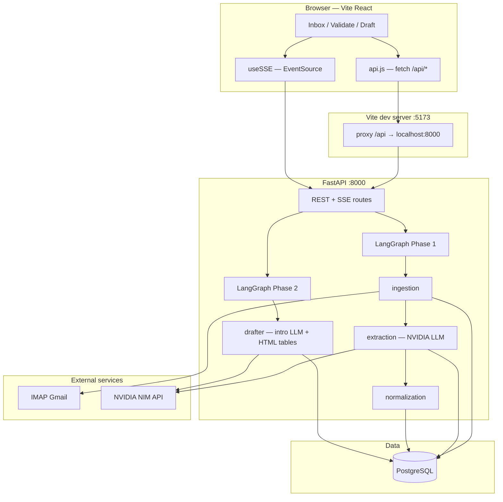

# AI-Powered Shipbroking Email Parser

Agentic pipeline that fetches `.eml` attachments from Gmail (IMAP), extracts vessel position rows with **NVIDIA NIM**, stores everything in **PostgreSQL**, and serves a **three-stage React UI**: Inbox → Validation grid → Consolidated HTML draft with a **zone map** (Leaflet). Real-time progress uses **Server-Sent Events (SSE)**.

Repository: [github.com/DeoUtkarsh/Asset_Mail_Parsing](https://github.com/DeoUtkarsh/Asset_Mail_Parsing)

---

## Architecture (high level)



---

## End-to-end flow

1. **User clicks “Fetch Mails”**  
   - `POST /api/fetch-emails` starts **Phase 1** in the background and returns a `job_id`.  
   - Frontend opens `GET /api/events/{job_id}` (SSE) for live attachment status.

2. **Phase 1 (LangGraph)** — `workflow.py`  
   - **Ingestion** — IMAP: find matching parent email, save rows, discover `.eml` / `message/rfc822` parts.  
   - **Extraction** — For each attachment, call NVIDIA LLM → JSON vessel list → upsert into DB.  
   - **Normalization** — Build the **superset column list** across all rows for the grid.

3. **Inbox UI**  
   - Polls / subscribes via SSE while extraction runs.  
   - **Validate →** (top bar when email is `ready_for_validation` or `drafted`) switches to Validate with the active `email_id`.  
   - **Preview** loads raw text + vessels per attachment.

4. **Validation UI**  
   - `GET /api/emails/{id}/vessels` + `/columns` powers **TanStack Table**.  
   - Double-click cells to edit; changes `PUT /api/vessels/{id}`.  
   - **Delete Mode** toggles row delete.  
   - **Checkboxes** — draft can use **selected rows only**; if none selected, **all rows** are sent.

5. **Draft generation**  
   - `POST /api/generate-draft` with `{ email_id, vessels }` starts **Phase 2**, returns `job_id`.  
   - SSE delivers `drafting_done` with `draft_html` + `zones` (lat/lng/count per broad zone).  
   - **Drafter** groups rows by mapped zone (e.g. STRAITS/SEA, FAR EAST), builds HTML tables, asks LLM for a short intro only.

6. **Draft UI**  
   - Renders HTML in a sandboxed iframe, map + legend beside it, **Copy to Clipboard** for plain text.

---

## Tech stack

| Layer | Technology |
|--------|------------|
| Backend | Python 3.11+, FastAPI, uvicorn |
| Orchestration | LangGraph (Phase 1 + Phase 2) |
| LLM | NVIDIA NIM (configurable, e.g. `nvidia/nemotron-3-super-120b-a12b`) |
| Database | PostgreSQL (local or any host; accessed via `pg_db.py` Supabase-style API) |
| Real-time | SSE (`sse-starlette`), `useSSE.js` |
| Frontend | React 18, Vite, TailwindCSS |
| Grid | TanStack Table v8 |
| Map | Leaflet / react-leaflet |

---

## Repository layout

```
├── schema.sql                 # DDL — run once on your PostgreSQL database
├── .gitignore
├── README.md
├── retry_errors.py            # Optional: retry failed extractions (configure model inside script)
├── debug_errors.py            # Optional debugging helper
├── backend/
│   ├── .env.example           # Template — copy to .env
│   ├── main.py                # FastAPI routes, SSE, CORS
│   ├── config.py              # Pydantic Settings → env vars
│   ├── database.py            # DB singleton (alias `supabase` for agents)
│   ├── pg_db.py               # PostgreSQL query builder (Supabase-like)
│   ├── models.py              # Request/response models
│   ├── imap_client.py         # Gmail IMAP + .eml parsing
│   ├── sse_manager.py         # In-memory SSE fan-out per job_id
│   ├── workflow.py            # LangGraph graphs
│   └── agents/
│       ├── ingestion.py
│       ├── extraction.py
│       ├── normalization.py
│       └── drafter.py         # Zone grouping + HTML + intro LLM
└── frontend/
    ├── vite.config.js         # Dev server + proxy /api → :8000, allowedHosts for ngrok
    ├── package.json
    └── src/
        ├── App.jsx            # Tabs + activeEmailId + draft state
        ├── services/api.js    # All REST calls under /api
        ├── hooks/useSSE.js
        └── components/
            ├── InboxView/
            ├── ValidationView/
            └── DraftView/
```

---

## Prerequisites

- **Python 3.11+**
- **Node.js 18+** (for Vite)
- **PostgreSQL** (e.g. local via pgAdmin) — database created and `schema.sql` applied
- **Gmail** account with an **App Password** for IMAP
- **NVIDIA NIM** API key ([NVIDIA API](https://integrate.api.nvidia.com))

---

## One-time setup

### 1. Database

Create a database (e.g. `email_parser`), then run the full **`schema.sql`** in pgAdmin or `psql`.

### 2. Backend

```powershell
cd backend
copy .env.example .env
# Edit .env: EMAIL_*, FILTER_SENDER, TARGET_SUBJECT, NVIDIA_*, PG_*
```

```powershell
# From repo root — create venv if needed
python -m venv venv
.\venv\Scripts\Activate.ps1
cd backend
pip install -r requirements.txt
```

### 3. Frontend

```powershell
cd frontend
npm install
```

---

## Run locally

**Terminal 1 — API**

```powershell
cd backend
..\venv\Scripts\Activate.ps1
uvicorn main:app --reload --port 8000
```

- API: `http://localhost:8000`  
- Docs: `http://localhost:8000/docs`

**Terminal 2 — UI**

```powershell
cd frontend
npm run dev
```

- App: `http://localhost:5173`

---

## Optional: share via ngrok

Tunnel the **Vite** port so `/api` is still proxied on your machine:

```text
ngrok http 5173
```

Ensure `frontend/vite.config.js` allows your ngrok host (`allowedHosts`). Keep **backend + frontend + ngrok** running; sleep/VPN/firewall will break the link.

---

## Environment variables

| Variable | Purpose |
|----------|---------|
| `EMAIL_USER` | Gmail address |
| `EMAIL_PASSWORD` | Gmail **App Password** |
| `IMAP_SERVER` / `IMAP_PORT` | Default `imap.gmail.com` / `993` |
| `FILTER_SENDER` | Only process emails from this sender |
| `TARGET_SUBJECT` | Subject substring filter |
| `NVIDIA_API_KEY` | NVIDIA NIM key |
| `NVIDIA_LLM_MODEL` | Chat model for extraction + draft intro |
| `NVIDIA_API_BASE_URL` | Default NVIDIA integrate endpoint |
| `PG_HOST` / `PG_PORT` / `PG_DATABASE` / `PG_USER` / `PG_PASSWORD` | PostgreSQL connection |
| `MAX_ATTACHMENTS` | `0` = process all attachments (demo) |

---

## API summary (prefix `/api`)

| Method | Path | Role |
|--------|------|------|
| POST | `/fetch-emails` | Start Phase 1 → `job_id` |
| GET | `/events/{job_id}` | SSE stream |
| GET | `/emails` | List parent emails + attachment summaries |
| GET | `/emails/{id}/attachments` | Attachments for one email |
| GET | `/attachments/{id}/raw` | Raw text for preview |
| GET | `/attachments/{id}/vessels` | Vessels for one attachment |
| GET | `/emails/{id}/vessels` | All vessels for validation grid |
| GET | `/emails/{id}/columns` | Superset column keys |
| PUT | `/vessels/{id}` | Update row |
| DELETE | `/vessels/{id}` | Delete row |
| POST | `/emails/{id}/vessels` | Add blank row |
| POST | `/generate-draft` | Phase 2 → `job_id`, then SSE `drafting_done` |

---

## Gmail App Password

1. Google Account → Security → **2-Step Verification** on.  
2. **App passwords** → create for Mail.  
3. Use the 16-character value as `EMAIL_PASSWORD` (no spaces).

---

## License / usage

Demo-oriented local stack; do not commit `.env` or real credentials. This repo uses **MIT-friendly** frontend dependencies (e.g. TanStack Table, Leaflet).

---

## Push branch `dev_testing` (you run manually)

From the repo root, with `origin` pointing at GitHub:

```powershell
cd D:\Asset_Modules\Email_Parser_Two
git status
git checkout -b dev_testing
git add .
git commit -m "docs: architecture README, .gitignore; align with PostgreSQL stack"
git push -u origin dev_testing
```

If `dev_testing` already exists remotely:

```powershell
git fetch origin
git checkout dev_testing
git merge main
# or: git rebase main
git push origin dev_testing
```

If you only want to update the remote branch from your current branch:

```powershell
git push -u origin HEAD:dev_testing
```
